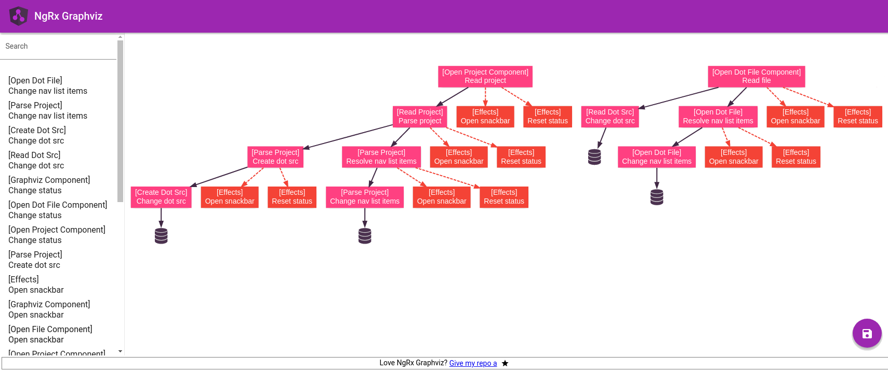

# Ngrx Graphviz
Ngrx Graphviz is a tool that analyzes the AST (Abstract Syntax Tree) of Typescript projects looking for ngrx actions and effects.
The result is processed by [Graphviz](https://graphviz.org/) which represents cause-effect relationships between actions as a diagram.

## How to use it
- Go to [Ngrx Graphviz](https://a-p-z.github.io/ngrx-graphviz/)
- Click on 
- Select your project folder (tsconfig.json must be present into the folder)
- Wait for the result

## Legend
|||
:---|:---
                      | side effect, A dispatches B
 | [non-dispatching effect](https://ngrx.io/guide/effects/lifecycle#non-dispatching-effects)
                       | dispatched action in case of error
                               | action handled by a reducer to perform a state transition

## Limitation
Ngrx Graphviz is able to resolve Actions, Effect and Reducers created by
- [createAction](https://ngrx.io/api/store/createAction)
- [createEffect](https://ngrx.io/api/effects/createEffect)
- [createReducer](https://ngrx.io/api/store/createReducer)

# Related projects
- [NgRx Vis](https://github.com/co-IT/ngrx-vis)
- [NgRx Visualizer](https://github.com/google/ngrx-visualizer)

